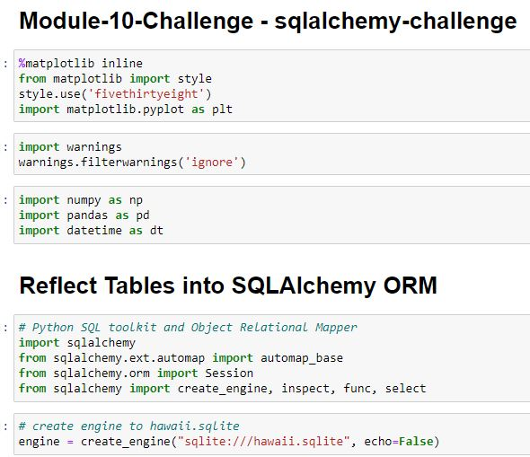

# Module-10-Challenge | sqlalchemy-challenge

## The set up: 

For some unknown reason, I've decided to take a trip to Honolulu and because I'm a masochist, I'm going to do all this exercise of gathering climate and precipitation data. I'm going to bring this data in Jupiter notebook utilizing pandas and establish what it is. Do some exploring, plot a few things and then I'm going to come up with a fun idea of making a API. Using Python file and reaching out to my localhost port 5000, I’ll have the “app.py” return calls from that same set of data.
    
Clearly for fun as planning a vacation should be...
    
:octocat::panda_face::snake::octocat::panda_face::snake::octocat::panda_face::snake:

### Imporat the tools and bring that data over here!
 

