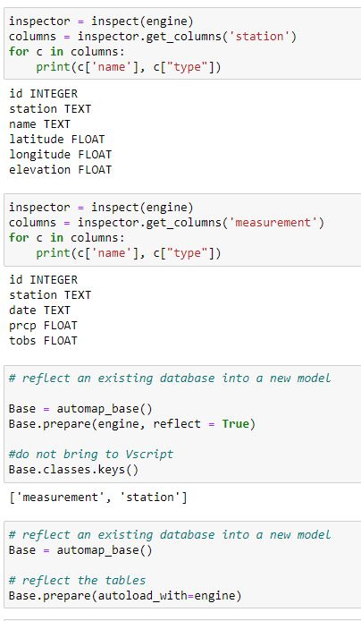
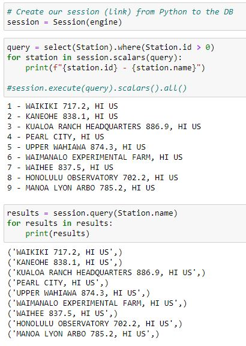
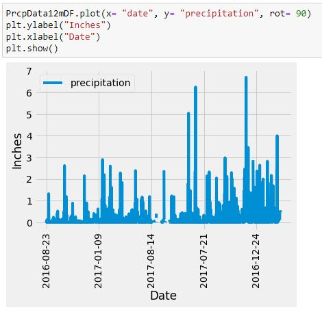
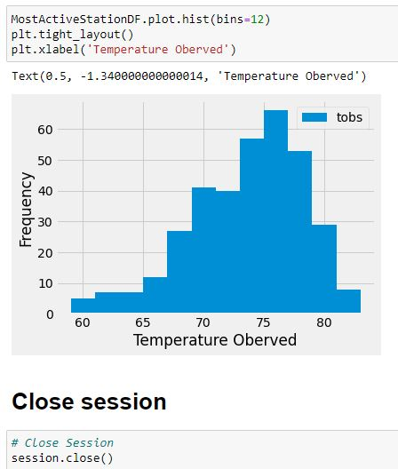
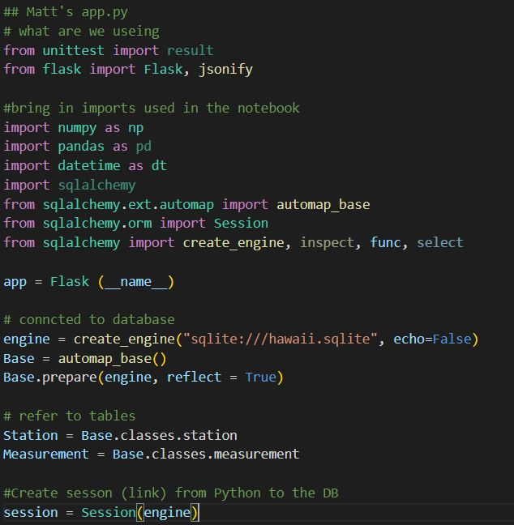
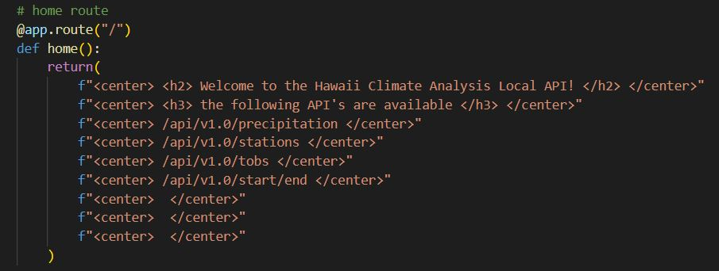
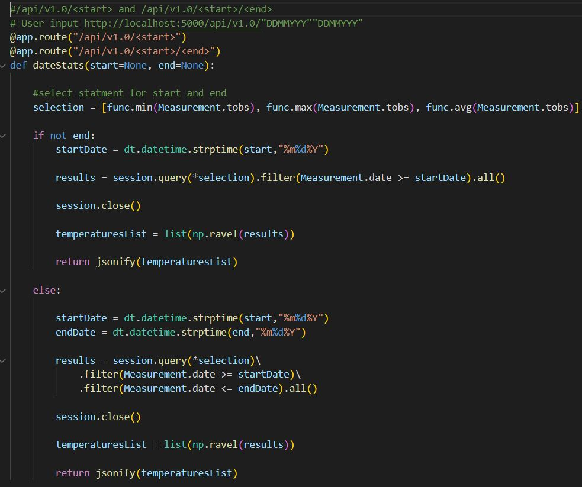

# Module-10-Challenge | sqlalchemy-challenge

:octocat::panda_face::snake::octocat::panda_face::snake::octocat::panda_face::snake:

## The set up: 
I've decided to take a trip to Honolulu and because I'm a masochist, I'm going to do all this exercise of gathering climate and precipitation data. I'm going to bring this data in Jupiter notebook utilizing pandas and establish what it is. Do some exploring, plot a few things and then I'm going to come up with a fun idea of making a API. Using Python file and reaching out to my localhost port 5000, I’ll have the “app.py” return calls from that same set of data.
    
Clearly for fun as planning a vacation should be...
    

## Jupiter notebook work :milky_way: :panda_face:

### Import the tools and bring that data over here!
   - 

### Lets explore that data and get them in calsses
   - 

### With "session" conncted via the engine we can start querying this data in a new way. 
   - 
   
### We answer all the question we had with varies statements and plot a few, always remembering to close our sessions
   -  See Surfsup > climate_starter.ipynb for all results 
   -  
   - 
  
  
## Creating a Python application to act as a API :eyeglasses::snake:

### Let's make sure to import those exact same tools and flask, we also need to establish the same engine connection create sessions. So, we could use those same queries in visual studios as we just did in Jupiter notebook. <i>I’m all about recycling!</i> 
- 
  
  
### Next, I made the page, then I started to make all the different routes. <i>Sounds easy… Not easy.</i> 
See Surfsup > app.py for all content
- 
- 

# This completes the assignment <i> "Module 10 - sqlalchemy-challenge."</i>  

:+1::octocat: 
-  API does work and all code runs without error. I will be returning for the BONUS section. 
Thank you
 
